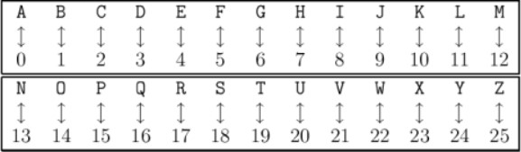
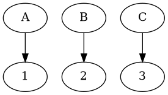

#+title: Cryptarithme
#+author: Guillaume BEUVOT - Prep'ISIMA
#+email: guillaume.beuvot@etu.uca.fr

#+startup: inlineimages

#+options: toc:2
#+options: p:t
#+options: H:4
#+SETUPFILE: https://fniessen.github.io/org-html-themes/org/theme-readtheorg.setup

[[file:Cryptarithme.txt][Lien vers le fichier .org]]

* Introduction au puzzle

Un cryptarithme est un puzzle posé comme une opération entre des groupes de lettres donnant un résultat lui aussi sous forme d'un groupe de lettres.

Le but est de trouver quelle lettre corresppond à quel chiffre pour que l'opération donne bien le résultat en ayant remplacé toutes les lettres par des chiffres.

Cela peut être vu comme une équation où il faut trouver un correspondance entre les chiffres et les lettres

Un opération peut ainsi ressembler à ça : 

AA + BB = CC

Ou à ça :

 AA

+BB

___

 CC

Ici, le résultat peut être, par exemple, 

#+begin_src dot :results file :file gr1.png :exports both
    Digraph{x[label="1"]y[label="2"]z[label="3"]
    A->x
    B->y
    C->z

    }
#+end_src

#+RESULTS:

Dans le puzzle Codingame, l'opération étudiée est l'addition.

De plus il n'existe qu'un seul résultat pour un cryptarithme, et une lettre correspond à un chiffre entre 0 et 9

Nous pouvons donc en conclure qu'il ne peut y avoir que 10 lettres au maximum dans ce style de cryptarithme.

** Les données auxquelles nous disposons sont donc

- Le nombre de groupes de lettres, ou mots, dans une opération, un entier compris entre 2 et 5 inclus
- Tous les mots composant l'opération, des chaînes de caractères
- Le mot correspondant au résultat de l'opération

** Les données à renvoyer sont donc
- Une ligne pour chaque lettre composant l'opération, suivie de sa valeur (le chiffre auquel elle correspond), un caractère suivi d'un entier

Les lettres doivent être ordonnées par ordre alphabétique

* Résolution du puzzle

** Résumé de la solution

Il existe une méthode pour résoudre les cryptarithmes de manière générale, mais son implémentation n'est pas évidente en programmation, surtout en langage C.

Nous allons plutôt tester toutes les combinaisons possibles, jusqu'à trouver celle qui correspond aux critères suivant :

- Chaque lettre est associée à un chiffre unique
- En transformant chaque lettre en chiffre, l'opération reste cohérente

Cette méthode est aussi connue sous le nom de /brute-force/, une méthode qui est connu dans le piratage

Elle présente cependant un défaut majeur : sa complexité.

En effet, plus le nombre de possibilités est grand, plus l'algorithme mettra de temps avant de trouver la bonne combinaison.

Pour améliorer cette méthode, nous allons donc tenter de léduire le plus possible le nombre de possibilités, en évitant de tenter des combinaisons inutiles.

Nous savons déjà que le nombre de possibilités est au maximum de 10 factoriels, car il n'y a que 10 chiffres possibles.

Nous pouvons aussi prendre en compte un autre axiome qui n'a pas été présenté précédemment : Un groupe de lettres ne commence jamais par une lettre qui correspond à 0.

Cela réduit le nombre de possibilités.

** Transposition en langage C

Nous commençons par sauvegarder tous les mots de l'opération dans un tableau.

Cette sauvegarde se fait en deux temps: 
- Dans un premier temps, ce sont les mots composant l'opération qui sont sauvegardés
- Dans un second temps, nous sauvegardons le mot résultant de l'opération

Nous sauvegardons aussi les lettres dans le but de leur assigner une valeur plus tard

Une lettre sera définie par :

- La lettre elle-même
- Sa valeur
- Sa première place ou non dans un des mots dans lequel elle se situe

Les lettres étant maintenent sauvegardées dans un tableau, nous pouvons le trier pour que les lettres apparaissent dans l'ordre alphabétique.

Ensuite nous commençons à tester toutes les possibilités en appelant une fonction qui change la valeur des lettres:

- Nous regardons si la combinaison actuelle est valide
- Sinon, nous changeons la valeur des lettres jusqu'à trouver la bonne combinaison

Pour vérifier si la combinaison est valide, nous calculons la somme de toutes les lettres converties en chiffres des mots de l'opération et la comparons à la somme des lettres converties en chiffres du résultat

Pour convertir les lettres en chiffre, nous utilisons une fonction de calcul :

- Nous commençons par stocker toutes les lettres disponibles dans une tableau
- Nous initialisons ensuite un entier à 0
- Et pour chaque lettre du mot à calculer, nous multiplions l'entier par 10, puis nous y ajoutons la valeur de la lettre suivante

Si la combinaison en correcte, nous renvoyons le résultat.

** Code en langage C de la résolution

Nous commençons par créer une structure =letter_t=: 

#+begin_src c
typedef struct letter_t letter_t;
struct letter_t {
    char letter;
    int value;
    int firstLetter;
};
#+end_src

Elle contiendra :

+ une lettre, =letter=,
+ sa valeur, =value=,
+ ainsi qu'un entier informant sa première place ou non dans un mot (1 si c'est la première lettre d'un mot, 0 sinon), =firstLetter=.

Nous créons ensuite la fonction de calcul de la somme de la valeur des lettres d'un mot, =calc= :

#+begin_src c
int calc(char *word, letter_t cryptarithm[], int n) {
    int values[26];
    for (int i = 0; i < n; i++){
        values[cryptarithm[i].letter-'A'] = cryptarithm[i].value;
    }
    int k = 0;
    for (char *p = word; *p > 0 ; p++){
        k = 10*k + values[*p-'A'];
    }
    return k;
}
#+end_src

Elle renvoie un entier, qui est la somme pour un mot, prend en argument un mot(une chaîne de caractères), un tableaux de lettres(de la structure =letter_t=), ainsi que la taille du tableau.

Elle commence par initialiser un tableau de 26 cases, contenant les valeurs des lettres du tableau

Elle initialise ensuite un entier =k= à 0.

Ensuite, pour chaque lettre du mot, elle multiplie k par 10 et y ajoute la valeur de la lettre actuelle.

Elle renvoie k, un entier.

Nous écrivons ensuite une fonction =verif=, qui vérifie si une combinaison est valide ou non :

#+begin_src c
int verif(letter_t cryptarithm[], int n, int k, char words[6][100]) {
    int sum = 0;
    for (int i = 0; i < k; i++){
        sum += calc(words[i], cryptarithm, n);
    }
    return sum == calc(words[k], cryptarithm, n);
}
#+end_src

Elle renvoie un entier, qui agit comme un booléen, et prend en argument un tableau de structures de type =letter_t=, la taille du tableau, le nombre de mots au total, ainsi que les mots eux-mêmes 

Elle initialise une variable =sum= à 0, puis appelle la fonction =calc= sur chaque mot contenu dans l'opération et ajoute le résultat à =sum=

Elle renvoie 1 si la configuration est valide, c'est-à-dire que =sum= est égal au résultat de la fonction =calc= sur le mot final, 0 sinon.

Nous avons ensuite la fonction =changeLetters=, qui change de combinaisons jusqu'à trouver la bonne combinaison.

#+begin_src c
int changeLetters(letter_t cryptarithm[], int n, int x, int k, char words[6][100]) {
    int seen[10] = {0};

    if(cryptarithm[x].firstLetter){
        seen[0] = 1;
    }

    for(int i = 0; i < x; i++) {
        seen[cryptarithm[i].value] = 1;
    }

    for(int i = 0; i < 10; i++) {
        if(!seen[i]){
            cryptarithm[x].value = i;
            if((x == n-1 && verif(cryptarithm, n, k, words)) || (changeLetters(cryptarithm, n, x+1, k, words))){
                return 1;
            }
        }
    }
    return 0;
}
#+end_src

Elle renvoie aussi un booléen sous la forme d'un entier et prend en argument un tableau de structures de type =letter_t= , la taille du tableau, l'indice =x= d'une lettre dans le tableau et le nombre de mots total.

Elle initialise un tableau d'entiers à 0, =seen=, qui répertorie les entrées déjà étudiées, et met la première valeur à 1 si la lettre d'indice =x= du tableau est la première lettre d'un mot.

Ensuite, pour chaque lettre précédente dans le tableau, la valeur est marquée comme étudiée, donc la case correspondante dans le tableau =seen= est mise à 1.

Ensuite, pour chaque chiffre possible restant(si la case correspondante dans le tableau =seen= est à 1), la valeur est modifiée.

Si :
- la dernière case du tableau de lettres est atteinte et que la combinaison est valide
*OU*
- que la fonction =changeLetters=, appelée sur la lettre suivante dans le tableau, renvoie 1

Alors, la fonction renvoie 1.

Si cela ne se produit à aucun moment dans la boucle, alors la fonction renvoie 0.

Voici la fonction =place=, qui détermine la place d'une lettre dans le tableau de lettres :

#+begin_src c
int place(letter_t cryptarithm[], int n, char c) {
    for (int i = 0; i < n; i++) {
        if (cryptarithm[i].letter == c) return i;
    }
    return -1;
}
#+end_src

Cette fonction renvoie un entier, et prend en argument un tableau de lettres, sa taille ainsi qu'une lettre sous forme de caractère.

Elle parcourt l'ensemble du tableau et compare la lettre passée en argument avec chaque lettre.

Si une correspondance est trouvée, la fonction renvoie l'indice de la lettre.

Sinon, la valeur -1 est renvoyée.

Cette fonction nous aidera à déterminer si une lettre est déjà présente dans le tableau.

Nous entrons enfin dans la fonction =main=, la fonction principale:

#+begin_src c
letter_t cryptarithm[26];
int l = 0;
int N;
int count = 0;
char words[6][100];
#+end_src

Nous commençons par initialiser les variables dont nous aurons besoin :

- =cryptarithm=, le tableau de structures de type =letter_t=,
- =l=, le nombre de lettres différentes,
- =N=, le nombre de mots présents dans l'opération, 
- =words=, le tableau de mots.

Nous ajoutons ensuite chaque lettre au tableau de lettres :

#+begin_src c
scanf("%d", &N);
for (int i = 0; i < N; i++) {
    char word[100];
    scanf("%s", word);
    strcpy(words[i], word);
    for (char *p = words[i], *j = p; *p > 0; p++) {
        int k = place(cryptarithm, l, *p);
        if (k == -1) { 
            cryptarithm[l].letter = *p;
            cryptarithm[l].value = 0;
            cryptarithm[l].firstLetter = j == p;
            l++;
        }
    }
}
#+end_src

Pour chaque mot:
- Nous l'ajoutons au tableau
- Pour chaque lettre du mot, si la lettre n'est pas présente dans le tableau, alors elle y est ajoutée avec la valeur 0 et si c'est la première lettre rencontrée, alors elle y est ajoutée en tant que première lettre d'un mot

Nous faisons de même pour le mot correspondant au résultat:

#+begin_src c
char total[100];
scanf("%s", total);
strcpy(words[N], total);
for (char *p = words[N]; *p > 0; p++) {
    int k = place(cryptarithm, l, *p);
    if (k == -1) { 
        cryptarithm[l].letter = *p;
        cryptarithm[l].value = 0;
        cryptarithm[l].firstLetter = 0;
        k = l;
        l++;
    }
    if(first) {
        cryptarithm[k].firstLetter = 1;
    }
    first = 0;
}
#+end_src

Nous ordonnons ensuite les lettres par ordre alphabétique:

#+begin_src c
for(int i = 0, count = 0; i < 26; i++){
    for(int j = count; j < l; j++){
        if(cryptarithm[j].letter == i+'A'){
            letter_t temp = cryptarithm[count];
            cryptarithm[count] = cryptarithm[j];
            cryptarithm[j] = temp;
            count++;
            break;
        }
    } 
}
#+end_src

Pour chaque lettre de l'alphabet:
- Si la lettre est présente dans le tableau, alors elle y est déplacée jusqu'à sa position relative par rapport aux autres lettres présentes dans le tableau, c'est-à-dire que la lettre dont la place dans l'alphabet est la plus faible sera déplacée à la première case du tableau, et la lettre dont l'indice est celui qui est le plus proche sera placé juste après etc...

Nous appelons maintenant la fonction =changeLetters=, qui s'occupera de trouver la bonne combinaison :

#+begin_src
changeLetters(cryptarithm, l, 0, N, words);
#+end_src

Enfin, lorsque la bonne combinaison est trouvée, nous pouvons renvoyer le résultat :

#+begin_src c

for(int i = 0; i < l; i++) {
    printf("%c %d\n", cryptarithm[i].letter, cryptarithm[i].value);
}
return 0;

#+end_src

Certains morceaux de code sont inspirés de la solution de [[https://www.codingame.com/profile/d5c392afea168725e0415cd0afabd5d98358233][McKael]]

[[file:documentation/html/index.html][Documentation doxygen]]

* Solution d'un autre CodinGamer

La solution de [[https://www.codingame.com/profile/768232ecb241a0005e5a765a61a68ffe846225][Rsrsl]] utilise aussi le fait de trouver la bonne combinaison en passant par toutes les autres avant, en découpant son code en plus de fonctions, permettant une meilleure modularité :

#+begin_src c
#include <stdbool.h>
#include <stdio.h>
#include <stdlib.h>
#include <string.h>

const int nletters = 26;
int values[26];

void print_assignment();

bool check_solution(int N, char  words[N][100], char*  total) {

    if (values[total[0] - 'A'] == 0) return false;

  int query_value = 0;
  for (int i = 0; i < N; i++) {
    int word_value = 0;
    for (char *w = words[i]; *w; w++) {
      word_value = 10 * word_value + values[*w - 'A'];
    }
    query_value += word_value;
  }

  int total_value = 0;
  for (char *t = total; *t; t++) {
    total_value = 10 * total_value + values[*t - 'A'];
  }

  return total_value == query_value;
}

int letter_to_assign() {
  for (int i = 0; i < nletters; i++) {
    if (values[i] == -1) {
      return i;
    }
  }
  return -1;
}

bool assign_letter_to_digit(int letter, int digit) {

  for (int i = 0; i < nletters; i++) {
    if (values[i] == digit) {
      return false;
    }
  } 
  values[letter] = digit;
  return true;
}

void unassign_letter_from_digit(int letter, int digit) { values[letter] = -1; }

bool solve(int N, char **words, char *total) {
  int letter = letter_to_assign();
  if (letter == -1) {
    bool val = check_solution(N, words, total);
    if (val)
      print_assignment();
    return val;
  }
  for (int digit = 0; digit <= 9; digit++) 
  {
    if (assign_letter_to_digit(letter, digit)) {

      if (solve(N, words, total))
        return true;
      unassign_letter_from_digit(letter, digit);
    }
  }
  return false;
}

void print_assignment() {
  for (int i = 0; i < nletters; i++) {
    if (values[i] >= 0)
      printf("%c %d\n", i + 'A', values[i]);
  }
}

int main() {
  int N;
  scanf("%d", &N);

  char words[N][100];
  for (int i = 0; i < N; i++) {
    scanf("%s", words[i]);
  }

  char total[100];
  scanf("%s", total);

  for (int i = 0; i < nletters; i++) {
    values[i] = -2;
  }

  for (int i = 0; i < N; i++) {
    for (char *w = words[i]; *w; w++) {
      values[*w - 'A'] = -1;
    }
  }
  for (char *w = total; *w; w++) {
    values[*w - 'A'] = -1;
  }

  solve(N, words, total);
}

#+end_src

* Bilan

C'est un puzzle qui permet d'accroître ses connaissances en langage C en écrivant un algorithme répondant à un problème plus complexe.
