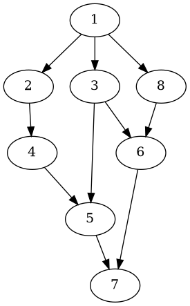

#+title: Dwarfs Standing On The Shoulders Of Giants
#+author: Guillaume BEUVOT - Prep'ISIMA
#+email: guillaume.beuvot@etu.uca.fr

#+startup: inlineimages

#+options: toc:2
#+options: p:t
#+options: H:4
#+SETUPFILE: https://fniessen.github.io/org-html-themes/org/theme-readtheorg.setup

[[file:images/uca.jpg]]

[[file:Dwarf.txt][Lien vers le document .org]]

* Introduction au puzzle

Il est commun pour certains auteurs de s'inspirer du travail d'autres grands auteurs, cela peut être vu comme des nains s'appuyant sur des épaules de géants afin de pouvoir tenir pour pouvoir voir plus loin.

Il est ainsi intéressant de se demander sur quel géant les nains s'appuient le plus afin d'accueillir sur leurs épaules d'autres nains et ainsi de suite ...

En d'autres termes, nous cherchons la plus longue chaine d'influence.

Nous pouvons voir ce problème comme un graphe orienté ou chaque auteur est représenté par un noeud et l'influence d'un auteur vers un autre est représenté par une branche qui par du noeud influant vers le noeud influencé

#+begin_src dot :results file :file gr1.png :exports both

    Digraph{
    1 -> 2,3,8
    2 -> 4
    3 -> 5,6
    4 -> 5
    5 -> 7
    6 -> 7
    8 -> 6
    }

#+end_src

#+RESULTS:

Sur ce graphe, 1 influence 2, 3 et 8, 2 influence 4 et ainsi de suite...

Nous pouvons donc ici voir que la plus grande chaîne d'influence est 1->2->4->5->7

Le but est donc de créer un algorithme qui permet de savoir quels sont les plus grands influenceurs.

** Les données auxquelles nous disposons sont donc

- Le nombre de relations d'influences, un entier inférieur à 10000
- Un influenceur, un entier
- Un influencé, un entier

** Les données à renvoyer sont donc
- Un entier qui représente la plus grande chaîne d'influence

* Résolution du puzzle

** Résumé de la solution

Nous allons reprendre le fonctionnement des listes chaînées pour pouvoir connaître pour chaque noeud :

 - La valeur du noeud
 - La valeur du noeud qui le précède
 - L'adresse du noeud suivant

Nous allons ensuite stocker chaque noeud dans un tableau contenant tous les noeuds

Pour chaque noeud du tableau nous regarderons le noeud qui le suit (dans le graphe) jusqu'à ce que l'adresse du noeud suivant n'existe pas, nous stockerons la taille du parcours et passons au noeud suivant, dans le tableau.

Nous récupérons la valeur de parcours maximale

** Transposition en langage C

Nous commençons par stocker toutes les valeurs rentrées dans les noeuds du tableau de noeuds :

- L'influenceur prend la valeur du noeud qui précède
- L'influencé prend la valeur du noeud actuel
- L'adresse du noeud suivant est nulle.

Nous parcourons ensuite tous les noeuds du tableau :

- Nous regardons si le noeud actuel porte la valeur d'un noeud qui précède un autre noeud dans le tableau (i.e si le noeud actuel précède un autre)

  Dans ce cas, nous assignons l'adresse du noeud précédé par le noeud actuel dans l'adresse du noeud qui suit le noeud actuel, sinon, cette adresse reste nulle.

Nous parcourons ensuite une nouvelle fois tous les noeuds du tableau :

- Chaque noeud est associé à une case dans un tableau qui contient toutes les longueurs de chaînes.

- La case associée au noeud prend la valeur de 1 plus la valeur retournée par une fonction de calcul de longueur de chaîne avec le noeud actuel

  La fonction est une fonction récursive dont le principe est le suivant :
  - Si l'adresse du noeud suivant est nulle, renvoyer 1
  - Sinon nous renvoyons 1 plus la valeur renvoyée par la fonction de calcul de longueur de chaîne avec le noeud suivant, récupéré dans l'adresse du noeud suivant.

- Si la valeur de la case est la plus grande du tableau jusqu'à la case actuelle, elle devient la longueur de chaîne maximum

Lorsque toutes les cases du tableau de longueurs sont remplies, la longueur maximum est donc la plus grande longueur de chaîne de tous les noeuds, c'est donc cette valeur que nous renvoyons.

** Code en langage C de la résolution

Nous commençons par créer la structure noeud :

#+begin_src c
struct node {
    int value;
    int prev;
    node_t *next;
};
#+end_src

- =value= est la valeur du noeud
- =prev= est la valeur du noeud précédent
- =next= est l'adresse du noeud suivant, elle contient donc le noeud suivant dans le graphe

Nous créons ensuite la fonction récursive search, qui prend en argument un neoud et renvoie un entier :

#+begin_src c
int search(node_t node) {
    if(node.next == NULL){
        return 1;
    }
    else {
        return 1 + search(*node.next);
    }
}
#+end_src

- Si la valeur de l'adresse du noeud qui suit est nul, nous renvoyons 1, puisque un noeud seul aura une longueur de chaîne de 1

- Sinon, nous renvoyons 1 plus la valeur renvoyée par search sur le noeud suivant.

Dans la fonction principale, nous déclarons un premier tableau de noeuds, =nodes= : 

#+begin_src c
node_t *nodes = NULL;

nodes = malloc(n*sizeof(node_t));
#+end_src

Ici, n est le nombres de relations d'influence

Nous créons un tableau de taille dynamique afin d'avoir un tableau de la bonne taille.

Nous créons ensuite un deuxième tableau d'entier, =outputs= :

#+begin_src c
int *outputs = NULL;

outputs = malloc(n*sizeof(int));
#+end_src

Il possède la même taille que le tableau précédent.

Avant de continuer, nous vérifions si l'allocation dynamique a bien marché pour éviter de manipuler de la mémoire qui ne nous a pas été allouée

#+begin_src c
if(nodes == NULL || outputs== NULL) {
    exit(1);
}
#+end_src

Ensuite, pour chaque relation d'influence rentrée : 

#+begin_src c
for (int i = 0; i < n; i++) {
    int x;
    int y;
    scanf("%d%d", &x, &y);
    nodes[i].value = y;
    nodes[i].prev = x;
    nodes[i].next = NULL;
}
#+end_src

- Le noeud numéro i du tableau prend comme valeur la valeur =y=, la valeur influencée, et =x=, la valeur influenceuse comme valeur suivante

- L'adresse du noeud suivante commence par être initialisée à =NULL=, donc inexistante.

Nous entrons ensuite dans une boucle qui va regarder pour chaque noeud si un noeud le suit dans le graphe :

#+begin_src c
for(int i = 0; i < n; i++){
    for(int j = 0; j < n; j++){
#+end_src

Ainsi, pour chaque noeud, nous parcourons le tableau de noeuds.

Pour savoir si un noeud suit un autre dans le graphe, nous regardons si la valeur d'un noeud et la valeur du noeud qui précède un autre noeud sont les mêmes :

#+begin_src c
if(nodes[i].value == nodes[j].prev){
    nodes[i].next = &nodes[j];
}
#+end_src

Avant de continuer, nous initialisons la longueur de chaîne maximum, =max=, à 1, car un noeud seul possède une longueur de chaîne de 1

#+begin_src c
int max = 1;
#+end_src

Pour chaque neoud du tableau :

#+begin_src c
for(int i = 0; i < n; i++){
    outputs[i] = 1 + (search(nodes[i]));
    max = outputs[i]>max?outputs[i]:max;
}
#+end_src

- Nous passons le noeud dans la fonction search et la case correspondante dans le tableau =outputs= prend la valeur 1 plus la valeur renvoyée par la fonction

- Si la valeur renvoyée est plus grande que =max=, max prend comme valeur la valeur renvoyée.

Nous renvoyons ensuite la longueur de chaîne maximum, qui est la valeur de =max=

#+begin_src c
printf("%d\n",max);
#+end_src

Nous libérons enfin les tableaux =nodes= et =outputs= :

#+begin_src c
free(nodes);
free(outputs);
nodes = NULL;
outputs = NULL;
return 0;
#+end_src

[[file:documentation/html/index.html][Lien vers la documentation doxygen]]

* Solution d'un autre CodinGamer

Le CodinGamer [[https://www.codingame.com/profile/45ac55eafadb99be29f247c0d5b6921e0453083][TheCodeWitcher]] a aussi décidé de créer une fonction récursive, snas utiliser de structure représentant les noeuds, mais en utilisant une grille où les abscisses sont les influenceurs et les ordonnées sont les influencés.

Dans cette grille, une case porte la valeur 1 si la valeur en abscisse influence la valeur en ordonnée :

#+begin_src c
for (int i = 0; i < n; i++) {
    int x;
    int y;
    scanf("%d %d", &x, &y);
    graph[x][y] = 1;
}
#+end_src

La fonction suivante est appelée pour toutes les valeurs en abscisses si elles n'ont pas été visitées :

#+begin_src c
void dfs(int node, int current_depth) {
    visited[node] = true;
    depth[node] = current_depth;
    if (current_depth > max_depth) {
        max_depth = current_depth;
    }

    for (int i = 0; i < 10000; i++) {
        if (graph[node][i] && !visited[i]) {
            dfs(i, current_depth + 1);
        }
    }

    visited[node] = false;
}
#+end_src

Cette fonction regarde donc toutes les valeurs qui ont pour abscisse la valeur de la case actuelle dans la boucle

* Bilan

Ce puzzle permet de pouvoir s'entraîner à raisonner sur des graphes et à travailler avec des noeuds. Il permet aussi de se familiariser avec les fonctions récursives dans le cadre du parcours d'une structure, à l'instar des arbres utilisés dans l'algorithme MinMax
