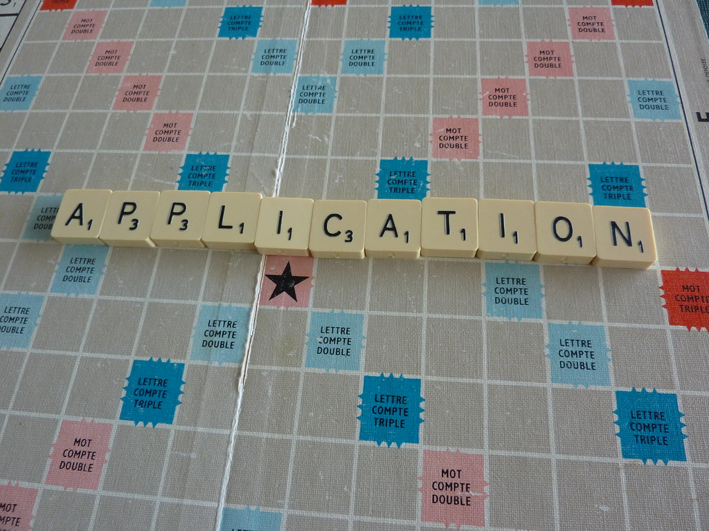
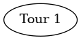
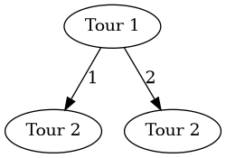
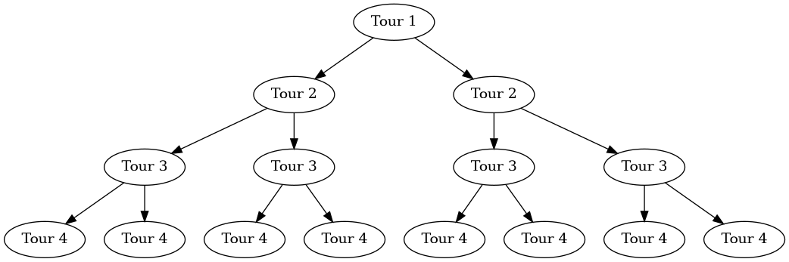
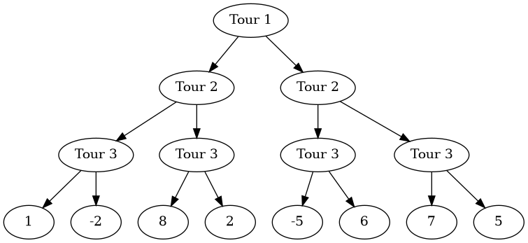
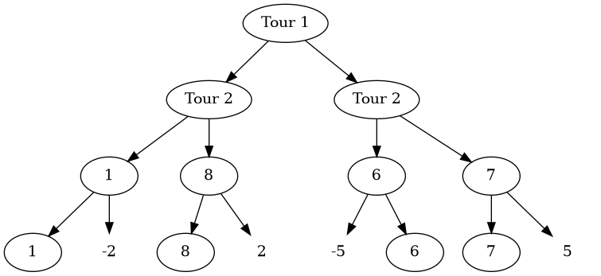
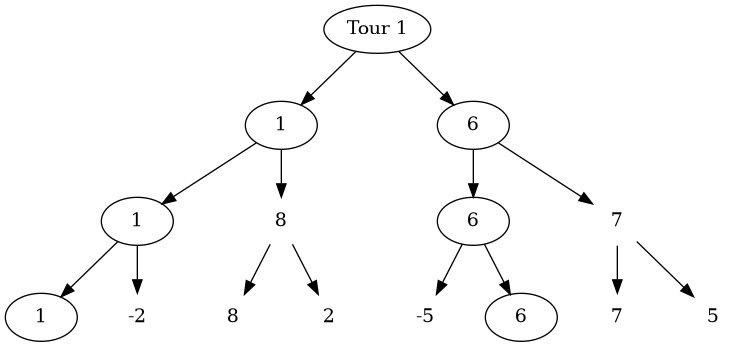
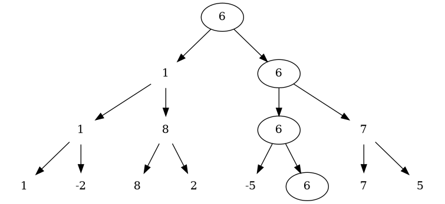
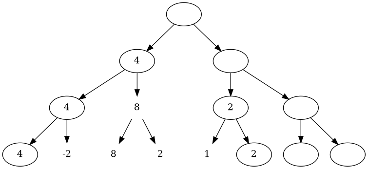

#+title: Minimax Simple Example
#+author: Guillaume BEUVOT - Prep'ISIMA
#+email: guillaume.beuvot@etu.uca.fr

#+startup: inlineimages

#+options: toc:2
#+options: p:t
#+options: H:4
#+SETUPFILE: https://fniessen.github.io/org-html-themes/org/theme-readtheorg.setup

[[file:images/uca.jpg]]

[[file:Minmax.txt][Lien vers le document .org]]

* Introduction au puzzle
2 joueuers s'affrontent dans un jeu au tour par tour.

Une pile de lettres se dresse devant les deux joueurs.

Chaque tour, un des deux joueurs pioche, au choix, soit la *première* lettre de la pile, soit la *deuxième*, pour la garder, puis l'autre joueur fait de même, jusqu'à ce que la pile de lettres soit vide.

Ensuite, les deux joueurs voient quels mot ils peuvent former avec les lettres qu'ils ont pioché, selon un dictionnaire défini associant un mot avec un score.

Le but de ce puzzle est de conseiller le premier joueur sur la lettre à prendre entre la première et la deuxième de la pile afin de maximiser l'écart de score avec le deuxième joueur à la fin de la partie.

Ainsi, nous cherchons à créer un algorithme permettant au joueur 1 de s'assurer une avance maximale face au joueur 2, au dépend de l'optimisation de son propre score.

*/Exemple/* : Un score final de 4-1 sera préférable à un score final de 15-13.

** Les données auxquelles nous disposons sont donc
- Un entier représentant le nombre de lettres dans la pile
- Un entier représentant le nombre de mots formables possibles
- Une chaîne de caractères représentant un mot possible, suivie de son score, un entier

** Les données à renvoyer sont donc
- La lettre à prendre entre la première et le deuxième dans la pile, un caractère
- Le score final si le joueur prend la lettre conseillée, une chaîne de caractères

* Résolution du puzzle

** Introduction à la solution

Pour créer cet algorithme, nous nous aiderons de l'algorithme minimax ou MinMax, un algorithme permettant de comparer facilement et récursivement les solutions finales afin d'obtenir la meilleure.

Cela nous est permis car le jeu ne possède pas un nombre de situations finales élevées.

Pour comprendre cet algorithme, nous pouvons visualiser une partie comme un arbre :

Un arbre est une structure de données composée de 2 éléments :
- Des noeuds, contenant des valeurs
- Des branches, qui relient un noeud à un ou plusieurs autres noeud

Cette structure possède aussi une hiérarchie, c'est-à-dire qu'il existe un noeud central (placé souvent en haut de l'arbre), qui n'est relié qu'à des noeuds secondaires, eux-mêmes reliés à d'autres noeuds, etc...

Ainsi, les noeuds les plus bas dans la hiérarchie (souvent en bas), sont appelées des feuilles.

Dans la résolution, l'arbre que nous étudierons sera un arbre binaire, c'est-à-dire, que chaque noeud possède 2 branches qui le relie aux noeuds inférieurs.

Nous pouvons donc ici visualiser un tour comme un noeud.

Voici donc le premier tour par exemple :

#+begin_src dot :results file :file gr1.png :exports both

    Digraph{a[label="Tour 1"]
    a

    }

#+end_src

#+RESULTS:

De ce premier tour deux tours suivants sont possibles, si le joueur prend la première, ou la deuxième lettre de la pile (1 ou 2 dans ce cas):

#+begin_src dot :results file :file gr2.png :exports both

    Digraph{a[label="Tour 1"]b[label="Tour 2"]c[label="Tour 2"]
    a->b[label="1"]

    a->c[label="2"]

    }

#+end_src

#+RESULTS:

Les derniers tours possibles sont représentés par des feuilles.

#+begin_src dot :results file :file gr3.png :exports both

    Digraph{a[label="Tour 1"]b,c[label="Tour 2"]d,e,f,g[label= "Tour 3"]h,i,j,k,l,m,n,o[label= "Tour 4"]
    a->b
    a->c

    b->{d,e}
    c->{f,g}

    d->{h,i}
    e->{j,k}
    f->{l,m}
    g->{n,o}

    }

#+end_src

#+RESULTS:

Une fois les feuilles atteintes, nous calculons la valeur de ces feuilles, ici, nous calculons le score de chaque joueur et renvoyons la différence entre le score du joueur 1 et du joueur 2.

#+begin_src dot :results file :file gr4.png :exports both

    Digraph{a[label="Tour 1"]b,c[label="Tour 2"]d,e,f,g[label= "Tour 3"]h[label= "1"]i[label= "-2"]j[label= "8"]k[label= "2"]l[label= "-5"]m[label= "6"]n[label= "7"]o[label= "5"]
    a->b
    a->c

    b->{d,e}
    c->{f,g}

    d->{h,i}
    e->{j,k}
    f->{l,m}
    g->{n,o}

    }

#+end_src

#+RESULTS:

Les noeuds plus haut prendront soit la valeur la plus haute parmi les neouds inférieurs, soit la valeur la plus basse, selon le joueur qui doit jouer pendant le tour représenté par le noeud.

Si le noeud représente le tour du joueur 1 (celui qui doit maximiser l'écart), la valeur choisie sera, de manière triviale, la plus haute, l'inverse serait en effet contre-productif

#+begin_src dot :results file :file gr5.png :exports both

    Digraph{a[label="Tour 1"]b,c[label="Tour 2"]d[label= "1"]e[label= "8"]f[label= "6"]g[label="7"]h[label= "1"]i[label= "-2"color= "white"]j[label= "8"]k[label= "2"color= "white"]l[label= "-5"color= "white"]m[label= "6"]n[label= "7"]o[label= "5"color= "white"]
    a->b
    a->c

    b->{d,e}
    c->{f,g}

    d->{h,i}
    e->{j,k}
    f->{l,m}
    g->{n,o}

    }

#+end_src

#+RESULTS:

Si le noeud représente le tour du joueur 2 (celui qui doit minimiser l'écart, voire le rendre négatif), la valeur choisie sera donc la plus basse, pour "simuler un coup intelligent face au joueur 1".

#+begin_src dot :results file :file gr6.png :exports both

    Digraph{a[label="Tour 1"]b[label= "1"]c[label="6"]d[label= "1"]e[label= "8"color= "white"]f[label= "6"]g[label="7"color= "white"]h[label= "1"]i[label= "-2"color= "white"]j[label= "8"color= "white"]k[label= "2"color= "white"]l[label= "-5"color= "white"]m[label= "6"]n[label= "7"color= "white"]o[label= "5"color= "white"]
    a->b
    a->c

    b->{d,e}
    c->{f,g}

    d->{h,i}
    e->{j,k}
    f->{l,m}
    g->{n,o}

    }

#+end_src

#+RESULTS:

Le coup à jouer pour le joueur 1 sera donc celui qui aura la plus grande valeur entre deux coups que le joueur 2 aura choisi parmi les plus petites valeurs données par le joueur 1 et ainsi de suite.

#+begin_src dot :results file :file gr7.png :exports both

    Digraph{a[label="6"]b[label= "1"color= "white"]c[label="6"]d[label= "1"color= "white"]e[label= "8"color= "white"]f[label= "6"]g[label="7"color= "white"]h[label= "1"color= "white"]i[label= "-2"color= "white"]j[label= "8"color= "white"]k[label= "2"color= "white"]l[label= "-5"color= "white"]m[label= "6"]n[label= "7"color= "white"]o[label= "5"color= "white"]
    a->b
    a->c

    b->{d,e}
    c->{f,g}

    d->{h,i}
    e->{j,k}
    f->{l,m}
    g->{n,o}

    }

#+end_src

#+RESULTS:

Ici par exemple, le joueur 1 doit commencer par prendre la deuxième lettre de la pile afin de lui garantir un écart de score de 6 avec le joueur 2.

*** Amélioration avec les paramètres alpha et beta

Pour des parties où le nombre de tours est faible, cet algorithme seul peut suffir, mais lorsqu'une partie possède 20 tours ou plus (ici, la pile peut faire jusqu'à 26 lettres), cela peut prendre du temps de devoir calculer tous les scores et les comparer, avec 2 options pour chaque noeud, 2^{n}-1 comparaisons doivent être faites, ce qui peut devenir très vite très grand.

Pour pouvoir réduire le nombre de comparaisons, certaines comparaisons peuvent être ignorées

Prenons une autre partie :

Considérons la première partie de l'arbre explorée, 4 est le score maximum que le joueur 1 a pu choisir à l'aide de l'algorithme

#+begin_src dot :results file :file gr8.png :exports both

    Digraph{a[label=""]b[label= "4"]c[label=""]d[label= "4"]e[label= "8"color= "white"]f[label= "2"]g[label=""]h[label= "4"]i[label= "-2"color= "white"]j[label= "8"color= "white"]k[label= "2"color= "white"]l[label= "1"color= "white"]m[label= 2]n[label= ""]o[label= ""]
    a->b
    a->c

    b->{d,e}
    c->{f,g}

    d->{h,i}
    e->{j,k}
    f->{l,m}
    g->{n,o}

    }

#+end_src

#+RESULTS:

Ici, 2 a été choisi par le joueur 1 car il est plus grand que 1.

Le joueur 2 devra donc choisir la valeur la mois élevée entre 2 et un autre nombre

Ainsi, le nombre choisi sera inférieur ou égal à 2, ce qui restera strictement inférieur à 4, qui a été trouvé précedemment.

Il n'est donc pas nécéssaire de trouver et comparer des valeurs si elles ne seront finalement pas prises.

2 sera donc automatiquement choisi par le joueur 2, ce qui laissera le joueur 1 choisir la valeur 4.

Cette situation peut bien évidemment se produire pour le joueur adverse.

Il suffit donc de sauvegarder les meilleurs scores de chacun des deux joueurs dans l'arbre afin de pouvoir comparer chaque valeur des noeuds afin de vérifier s'il est nécéssaire de continuer la recherche

- Pour le joueur 1, le meilleur score est la plus grande valeur (elle commence à moins l'infini)

- Pour le joueur 2, le meilleur score est la moins grande valeur (elle commence à plus l'infini)

** Résumé de la méthode

Ici, nous allons utiliser l'algorithme MinMax étudié

Pour chaque tour, deux options nous seront données et la valeur à optimiser pour les deux joueurs est l'écart de score

** Transposition en langage C

Nous commençons par créer une chaîne de caractères qui contiendra toutes les lettres de la pile

Ainsi, la première lettre de la chaîne sera la lettre au-dessus de la pile et les lettres suivantes dans la chaîne de caractère sont les lettres qui se trouvent en-dessous.

Nous créons aussi une sorte de dictionnaire qui associe à chaque mot de la liste de mots un score (qui lui a été donné)

Nous appelons ensuite une fonction qui se charge de trouver récursivement par l'algorithme minimax la bonne solution.

Nous donnons à cette fonction les valeurs de bêta et alpha, donc plus et moins l'infini, la pile pleine, 
les ensembles(vides) de lettres des deux joueurs, le dictionnaire mot-score ainsi que le nombre dans le dictionnaire et enfin la profondeur de l'arbre de recherche (ici fixé à 0, car c'est le premier tour)

Nous entrons ainsi dans une fonction récursive:
- Si la pile de lettres est vide, nous calculons le score des deux joueurs et l'enregistrerons dans une valeur. Nous renvoyons ensuite cette structure.

- Si c'est au tour du joueur 1 (celui que nous devons faire gagner):
        + Nous prenons une valeur de moins l'infini, cela nous servira de "score à battre" pour chaque sous-noeud
        + Nous copions la pile de lettres ainsi que l'ensemble de lettres du joueur 1.
        + Nous retirons ensuite la lettre au-dessus de la copie de la pile de lettres pour la mettre dans la copie de l'ensemble de lettres du joueur 1
        + Nous appelons ensuite récursivement la fonction minmax avec la pile et l'ensemble de lettres modifiés, afin de récupérer le noeud avec le score maximum récupéré dans les feuilles.
        + Le "score à battre" prend le meilleur score entre le "score à battre" actuel et le score récupéré à la suite de l'appel de la fonction minmax

        + Nous recommençons ensuite une deuxième fois ces instructions en réinitialisant les copies de la pile et de l'ensemble de lettre, puis en prenant cette fois la deuxième lettre de la pile
        + Avant de recommencer, nous regardons si le différence du "score à battre" est plus grande que alpha.
        + Si tel est le cas, alpha devient la différence du score des deux joueurs du "score à battre".
        + Enfin, si alpha est inférieur à beta, nous ne recommençons pas avec la deuxième lettre de la pile, cela évite donc de faire des appels inutils

        Si nous sommes en haut de l'arbre de recherche, nous affichons la lettre à prendre, ainsi que le score garanti en prenant cette lettre

- Si c'est au tour du deuxième joueur, l'algorithme est similaire à celui du premier joueur en changeant plusieurs détails:
        + Le "score à battre" est de plus l'infini, et prend la valeur du score le plus bas
        + L'ensemble de lettres copié est celui du joueur 2
        + Beta prend la valeur du score le plus bas, et alpha reste inchangé, le test et ses conséquences restent les mêmes.

La fonction finit donc par afficher la lettre recommendée ainsi que le score garanti, la fonction principale s'arrête donc après le premier appel.

** Code en langage C de la résolution

#+begin_src c
    char bd[100] = "";
    wscore_t dict[100];
#+end_src
Nous initialisons la pile et le dictionnaire
 

#+begin_src c   
    struct word_score {
        int score;
        char word[27];
    };
#+end_src

Une entrée du dictionnaire

Nous appelons maintenant la fonction principale minmax

#+begin_src c  
    minmax(bd, -65535, 65535, 1, "", "", dict,  q, 0);
#+end_src

Ici 65535 représente l'infini, un tel score ne sera jamais atteint

Nous appelons la fonctions minmax

#+begin_src c  
pscore_t minmax(char letters[], int a, int b, int play, char p1[], char p2[], wscore_t dict[], int n, int d) {
#+end_src

Prototype de la fonction minmax, letters est la pile, a et b sont alpha et beta, play détermine le joueur qui doit jouer (1 si vrai, 2 sinon), 
p1 et p2 sont les ensembles de lettres des joueurs 1 et 2,
dict est le tableau d'entrées de dictionnaire, n est le nombre de mots possible et d la profondeur, 0 étant le premier tour, donc en haut de l'arbre.

#+begin_src c  
    if(strlen(letters) == 0) {
        pscore_t output = {score(p1, dict, n),score(p2, dict, n)};
        return output;
    }
#+end_src

Cas d'arrêt, nous calculons le score des deux joueurs en renvoyant les deux scores, cela permettra de plus facilement afficher le score final, 7
les valeurs qui serviront de test seront la différence entre le score du premier joueur et du deuxième

#+begin_src c 
    struct player_score {
        int score1;
        int score2;
    };
#+end_src

La structure score:

#+begin_src c 
    int score(char result[], wscore_t dict[], int n){
#+end_src

Prototype de la fonction de calcul de score d'un joueur

#+begin_src c 
    int points = 0;
#+end_src

Nous initialisons les points à 0

#+begin_src c 
for(int i = 0; i < n; i++) {
#+end_src

Pour chaque entrée du dictionnaire

#+begin_src c
    for(int j = 0; j < strlen(dict[i].word); j++) {
#+end_src

Pour chaque lettre d'un mot du dictionnaire

Si la lettre ne se trouve pas dans l'ensemble de lettres du joueur, nous passons au mot suivant

#+begin_src c
    if(strchr(result, dict[i].word[j]) == NULL) {
        break;
    }
#+end_src

Sinon, si nous arrivons à la fin du mot, nous ajoutons au score du joueur le nombre de points que donne le mot

#+begin_src c
    else if(j == strlen(dict[i].word)-1){
        points += dict[i].score;
    }
return points;
#+end_src

Nous renvoyons le score du joueur

Revenons au premier cas récursif de la fonction minmax
#+begin_src c
    if(play)
#+end_src

Si le joueur 1 joue :
#+begin_src c
    int answer = 0;
    pscore_t value = {0, 65535};
    char l[27] = "", x[27] = "";
    strcpy(l, letters);
#+end_src

Nous initialisons les variables : answer est le numéro de la lettre à prendre dans la pile

Ici 65535 représente l'infini, un tel score ne sera jamais atteint

#+begin_src c
    for(int i = 0; i < 2; i++) {
#+end_src
Nous entrons dans une boucle qui se réalise deux fois, pour prendre les deux premières lettres seulement

#+begin_src c
    sprintf(x, "%s%c", p1, l[i]);
    strremove(l, i)
#+end_src

Nous retirons la i-ème lettre de la pile et l'ajoutons à l'inventaire du joueur 1 

#+begin_src c
void strremove(char *str, int n){
    char out[27] = "";
    int j = 0;
    for(int i = 0; i < strlen(str);i++){
        if(i != n){
            out[j] = str[i];
            j++;
        }
    }
    strcpy(str, out);
}
#+end_src

Fonction strremove qui retire un caractère de la pile

#+begin_src c
    pscore_t test = minmax(l, a, b, 0, x, p2, dict, n, d+1);
#+end_src

Nous appelons la fonction minmax, avec la pile sans la i-ème lettre, qui se trouve maintenant dans l'inventaire du joueur 1. Nous indiquons aussi que c'est au joueur 2 de jouer

#+begin_src c
    x[strlen(x)-1] = '\0';
    strcpy(l, letters);     
#+end_src

Nous retirons à la copie de l'inventaire du joueur 1 la i-ème lettre et la remettons dans la pile (ici, nous recopions la pile donnée en argument de la fonction pour la mettre dans la copie de la pile)
#+begin_src c
    if((test.score1-test.score2)>(value.score1-value.score2)){
        value=test;
        answer = i;
    }
#+end_src

Si la différence de score est plus grande que le score à battre, le score à battre prend la valeur du score obetenu avec la fonction et answer prend la valeur de i, ce qui veut dire qu'il faut prendre la i-ème lettre

    a = (value.score1-value.score2)>a?(value.score1-value.score2):a;
    if(b<=a)break;
Alpha prend la valeur maximum entre la différence du score à battre et alphe lui-même, et si alpha est plus petit que beta, nous sortons immédiatement de la boucle et arrêtons la recherche

À la fin de la boucle (recherche), le score à battre est renvoyé en étant le plus grand possible

#+begin_src c
    return value;
#+end_src

Les différences avec le joueur 2 sont celles-ci: La différence du score à battre est de plus l'infini, l'inventaire du joueur 2 est copié et la fonction est appelée avec la pile et l'inventaire du joueur 2 changés et en faisant jouer le joueur 1

Avant la recherche :

#+begin_src c
    pscore_t value = {65535, 0};         
    sprintf(y, "%s%c", p2, l[i]);   
    pscore_t test = minmax(l, a, b, 1, p1, y, dict, n, d+1);
#+end_src

Et pour chacune des deux premières lettres de la pile restante

#+begin_src c
    value = (test.score1-test.score2)<(value.score1-value.score2)?test:value;
    b = (test.score1-test.score2)<b?(test.score1-test.score2):b;
    if(b<=a)break;
#+end_src

Le score à battre cherche donc à être le plus faible possible, de même que pour beta.

Le même test est fait que pour le joueur 1.

Lorsque la meilleure possibilité remonte à la racine (tour 1), nous vérifions si la profondeur(le tour) est le premier, dans ce cas, après avoir selectionné la meilleure possibilité, nous renvoyons la lettre recommandée, qui est celle assurant le meilleur coup ainsi que les scores des deux joueurs à la fin de la partie :

#+begin_src c
if(!d) printf("%c %d-%d\n", letters[answer], value.score1, value.score2);
#+end_src

Cette instruction se situe juste avant le renvoi du score à battre (dans le cas où nous ne somme pas à la racine)

Voici le code sans commentaire :
#+begin_src c
#include <stdlib.h>
#include <stdio.h>
#include <string.h>
#include <stdbool.h>

typedef struct word_score wscore_t;
typedef struct player_score pscore_t;
struct word_score {
    int score;
    char word[27];
};
struct player_score {
    int score1;
    int score2;
};

int score(char result[], wscore_t dict[], int n){
    int points = 0;
    for(int i = 0; i < n; i++) {
        for(int j = 0; j < strlen(dict[i].word); j++) {
            if(strchr(result, dict[i].word[j]) == NULL) {
                break;
            }
            else if(j == strlen(dict[i].word)-1){
                points += dict[i].score;
            }
        }
    }
    return points;
}

void strremove(char *str, int n){
    char out[27] = "";
    int j = 0;
    for(int i = 0; i < strlen(str);i++){
        if(i != n){
            out[j] = str[i];
            j++;
        }
    }
    strcpy(str, out);
}

pscore_t minmax(char letters[], int a, int b, int play, char p1[], char p2[], wscore_t dict[], int n, int d) {
    if(strlen(letters) == 0) {
        pscore_t output = {score(p1, dict, n),score(p2, dict, n)};
        return output;
    }
    if(play) {
        int answer = 0;
        pscore_t value = {0, 65535};
        char l[27] = "", x[27] = "";
        strcpy(l, letters);
        
        for(int i = 0; i < 2; i++) {
            sprintf(x, "%s%c", p1, l[i]);
            strremove(l, i);
            
            pscore_t test = minmax(l, a, b, 0, x, p2, dict, n, d+1);
 
            x[strlen(x)-1] = '\0';
            strcpy(l, letters);            

            if((test.score1-test.score2)>(value.score1-value.score2)){
                value=test;
                answer = i;
            }
            a = (value.score1-value.score2)>a?(value.score1-value.score2):a;
            if(b<=a)break;
        }
        if(!d) printf("%c %d-%d\n", letters[answer], value.score1, value.score2);
        return value;
    }
    else {
        int answer = 0;
        pscore_t value = {65535, 0};
        char l[27] = {'\0'}, y[27] = {'\0'};
        strcpy(l, letters);

        for(int i = 0; i < 2 ; i++) {
            sprintf(y, "%s%c", p2, l[i]);
            strremove(l, i);
            pscore_t test = minmax(l, a, b, 1, p1, y, dict, n, d+1);
            y[strlen(y)-1] = '\0';
            strcpy(l, letters);
            value = (test.score1-test.score2)<(value.score1-value.score2)?test:value;
            b = (value.score1-value.score2)<b?(value.score1-value.score2):b;
            if(b<=a)break;
        }
        if(!d) printf("%c %d-%d\n", letters[answer], value.score1, value.score2);
        return value;
    }

}

int main()
{
    int n;
    int q;
    char bd[100] = "";
    scanf("%d%d", &n, &q);
    for (int i = 0; i < n; i++) {
        char letter[2];
        scanf("%s", letter);
        sprintf(bd, "%s%c", bd, letter[0]);
    }
    
    wscore_t dict[100];
    for (int i = 0; i < q; i++) {
        char word[11];
        int score;
        scanf("%s%d", word, &score);
        dict[i].score = score;
        sprintf(dict[i].word,"%s", word);
    }
    minmax(bd, -65535, 65535, 1, "", "", dict,  q, 0);
    return 0;
}
#+end_src
Ainsi, le code en entier, sans commentaire est le suivant :

* Solution d'un autre CodinGamer

Une autre solution de l'utilisateur [[https://www.codingame.com/profile/907c9ccd81091cee022baa60234db551987988][Alain-Delpuch]] sur CodinGame propose deux fonctions mini et maxi séparées, au lieu d'une seule fonction dont les cas varient.

Aussi, les fonction sont de type int car la structure de score est stockée dans un tableau et est modifiée lors calcul du score

Voici la fonction mini (similaire à maxi) :

#+begin_src c
int mini(game *g, int i, int j , int alpha, int beta){

    if (i == n) {
        return eval(g);
    }
    
    game ga;
    int hsave = h2;
    
    hash( h2, letters[i]) ;
    int va = maxi(&ga, j, j+1, alpha, beta);
    h2 = hsave;
    
    if ( va < beta ) beta = va ;
    
    if ( beta  < alpha ) { // cutoff
        *g = ga;
        return va;
    }
    
    if (j == n) {
        *g = ga;
        return va;
    }
    
    game gb;

    hash( h2, letters[j]) ;
    int vb = maxi(&gb,i,j+1, alpha, beta);
    h2 = hsave;

    if (va < vb){
        *g = ga;
        return va;
    } 
    
    *g = gb;
    return vb ;
}
#+end_src

La fonction de calcul de score, eval :

#+begin_src c
int eval(game * g){
    g->score1 = 0;
    g->score2 = 0;
    
    for (int i= 0; i < q; i++) {
        int h = hwords[i];
        if ( (h & h1) == h) g->score1 += scores[i];
        if ( (h & h2) == h) g->score2 += scores[i];
    }
    
    return g->score1 - g->score2;
}
#+end_src

* Bilan

Ce puzzle permet de se familiariser avec l'algorithme MinMax, un algorithme puissant qui permit à l'informatique une avancée majeure en permettant à l'ordinateur de battre l'Homme aux échecs avec la défaite de Garry Kasparov en 1997. Il permet ainsi de développer la réflexion sur la création d'algorithmes sur certains jeux
