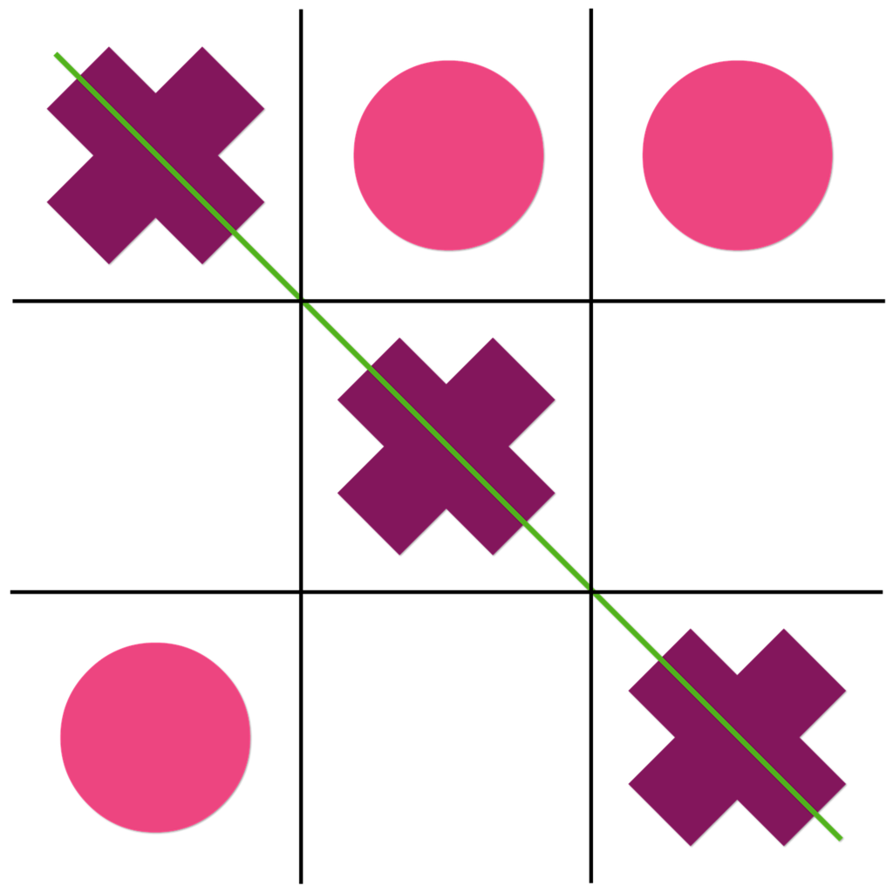
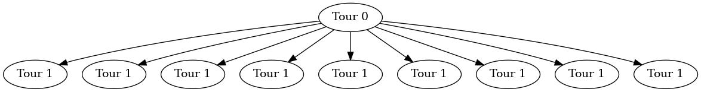

#+title: Tic Tac Toe
#+author: Guillaume BEUVOT - Prep'ISIMA
#+email: guillaume.beuvot@etu.uca.fr

#+startup: inlineimages

#+options: toc:2
#+options: p:t
#+options: H:4
#+SETUPFILE: https://fniessen.github.io/org-html-themes/org/theme-readtheorg.setup

[[file:images/uca.jpg]]

[[file:TicTacToe.txt][Lien vers le document .org]]

*Préambule

Nous ne traiterons pas ici d'un puzzle classique mais d'un challenge, faisant s'affronter les algorithmes de deux joueurs.

* Introduction au challenge

Le tic-tac-toe(ou morpion ou oxo) est un jeu au tour par tour faisant s'affronter deux adversaires sur une grille de 3x3 cases sur lesquelles l'un des joueurs doit poser des symboles (généralement une croix) jusqu'à en aligner trois horizontalement, verticalement ou diagonalement, tout en empêchant l'autre joueur d'aligner trois symboles(généralement des ronds)

Le but de ce challenge est, en tant que l'un des deux joueurs, créer un algorithme capable de gagner contre les autres algorithmes.

Nous étudierons ici une solution utilisant l'algorithme MinMax, pour comprendre son fonctionnement, voir la résolution du puzzle Simple Minimax Example

** Les données auxquelles nous disposons sont donc
- Un entier qui est le numéro de la ligne à laquelle appartient la case prise par l'adversaire. Si l'adversaire n'a pas encore pris de case, cette valeur vaut -1
- Un entier qui est le numéro de la colonne à laquelle appartient la case prise par l'adversaire. Si l'adversaire n'a pas encore pris de case, cette valeur vaut -1
- Un entier qui représente le nombre de case restantes
- Les lignes auxquelles appartiennent toutes les cases restantes (non-prises). Ce sont des entiers
- Les colonnes auxquelles appartiennent toutes les cases restantes (non-prises). Ce sont des entiers

** Les données à renvoyer sont donc
- La ligne à laquelle appartient la case à prendre pour ce tour
- La colonne à laquelle appartient la case à prendre pour ce tour

* Résolution du puzzle

** Résumé de la solution
Nous allons ici utiliser l'algorithme minimmax, afin de garantir un score final le moins bas possible et non obtenir un score final élevé avec risque.

L'arbre utilisé sera donc plus complexe qu'un arbre binaire (où chaque noeud se divise en 2 branche seulement).

En effet, chaque noeud se divisera en autant de branche qu'il restera de cases libres sur la grille.

Pour le premier tour, où toutes les cases sont libres, cela donne :
#+begin_src dot :results file :file gr1.png :exports both

    Digraph{a[label= "Tour 0"]b,c,d,e,f,g,h,i,j[label= "Tour 1"]
    a->{b,c,d,e,f,g,h,i,j}

    }

#+end_src

#+RESULTS:

Car, en effet, il y a neuf cases libres, donc neuf possibilités.

Donc, au tour n, il y a 9-n possibilités, donc 9-n divisions du noeud représentant le tour n.

** Transposition en langage C

Nous commençons par créer deux tableaux: un qui contiendra les colonnes des cases conseillées, et un qui contiendra les lignes des cases conseillées
Nous créons aussi un tableau en deux dimensions qui représentera le plateau, et sera remmpli au fur et à mesure avec nos coups et ceux de l'adversaire

Nous remplissons ensuite les tableaux des cases conseillées avec toutes les cases possibles

Nous appelons ensuite la fonction minimax, qui nous donnera l'indice de la case recommendée.

Cette fonction récursive reprend le principe de la fonction MinMax (ou minimax):

Elle prend en argument la profondeur (le nombre de cases restantes), un paramètre alpha, un paramètre beta, le plateau, un tableau contenant les lignes des cases libres et un tableau contenant les colonnes des cases libres.

Deux cas se présentent ainsi à nous : 

S'il reste moins de cinq cases libres, nous regardons la grille pour voir si la partie n'est pas déjà terminée
En effet, s'il reste strictement moins de cinq cases, cela veut dire que cinq cases sont remplies, donc que le premier joueur a posé trois croix.
Si ces trois croix sont alignées, il préférable de le savoir le plus tôt possible.
Dans ce cas, nous vérifions si trois symboles sont alignés, et si tel est le cas, le noeud devient une feuille de l'arbre et nous renvoyons le score.

S'il reste cinq cases ou plus, ou que la partie n'est pas terminée (donc que trois symboles ne sont pas alignés), deux cas se présentent à nouveau à nous :

Dans le premier cas, le tour actuel doit être joué par le joueur 1 (Nous), ainsi nous nous fixons un score de -10 (qui doit être battu avec une valeur supérieure)
Ainsi, pour chaque case libre :

Nous copions la grille et les tableaux contenant les cases libres, en retirant la case libre étudiée et en la plaçant sur la grille, puis en faisant jouer le joueur 2

Nous faisons appel à la fonction minimax avec la grille et les tableaux de cases libres modifiées, afin d'en récupérer la valeur du noeud inférieur

Nous regardons si cette valeur est supérieure au score à battre, si oui, elle remplace le score à battre, en sauvegardant le chemin pris.

Nous regardons ensuite si alpha est supérieur au score à battre, pour pouvoir le remplacer dans le cas contraire.

Nous regardons ensuite si alpha est supérieur ou égal à beta.

Dans un tel cas, nous arrêtons la recherche pour éviter de passer plus de temps sur la recherche

Nous renvoyons ensuite le score à battre, qui est donc le plus haut possible.

Si c'est au tour du deuxième joueur, nous répétons ces instructions, avec plusieurs changements.
Le score à battre commence par être à 10, est doit être battu en étant inférieur.
L'appel à la fonction minimax change en faisant jouer le premier joueur au tour suivant.
La valeur récupérée par le noeud inférieur doit donc être la plus faible possible.
Cette fois-ci, c'est beta qui est changé, remplacé par la plus faible valeur possible.

Ces appels récursifs s'effectuent jusqu'à trouver parmi les feuilles la grille la plus avantageuse possible pour le premier joueur, en prenant en compte les choix du deuxième joueur.

La fonction renvoie ainsi le coup le plus efficace possible pour le joueur.

Nous renvoyons donc la case correspondante dans les tableaux contenant les coups possibles.

** Code en langage C de la solution

#+begin_src c
    int *rowsTab = NULL, *colsTab = NULL;
    int board[3][3] = {{0}};
#+end_src
Nous commençons par initialiser les variables : rowsTab contiendra les lignes (ordonnées) des cases libres, colsTab les colonnes(abscisses) et board sera une représentation de la grille à chaque tour

Nous entrons ensuite dans une boucle infinie, qui s'arrête lorsque la partie est terminée ou qu'un programme ne fonctionne pas
#+begin_src c
    if(opponent_row != -1) {
        board[opponent_row][opponent_col] = -1;
    }    
#+end_src
Pour chaque tour, si l'adversaire a pris une case, nous récupérons les coordonnées de cette case, puis nous l'inscrivons dans la grille, -1 représente le symbole de l'adversaire et 1 représente notre symbole, 
cela nous sera utile au moment de chercher le meilleur coup.

#+begin_src c
    rowsTab = malloc(valid_action_count*sizeof(int));
    colsTab = malloc(valid_action_count*sizeof(int));
    if(rowsTab == NULL || colsTab == NULL) {
        exit(1);
    }
#+end_src
Nous créons ainsi les tableaux de cases libres, dont la taille est le nombre de cases libres qui a été donné.

#+begin_src c
    for (int i = 0; i < valid_action_count; i++) {
        int row;
        int col;
        scanf("%d%d", &row, &col);
        rowsTab[i] = row;
        colsTab[i] = col;
    }
#+end_src
Pour chaque case libre nous renseignons son abscisse et son ordonnée dans la même case de leur tableau respectif, pour faciliter la recherche

#+begin_src c
    int output = abs(minimax(valid_action_count, -10, 10, 1, board, rowsTab, colsTab));
#+end_src
Nous appelons ensuite la fonction minimax, afin de nous donner la case à prendre pour ce tour.
L'explication de la valeur absolue sera donnée plus tard.

#+begin_src c
    int minimax(int d, int a, int b, int play, int board[3][3], int *rows, int *cols){
#+end_src
Voici le prototype de la fonction minimax, elle prend en paramètre :

d, un entier qui donne le nombre de cases encore non libres

a, le paramètre alpha, et b, le paramètre beta

play, un booléen qui indique si c'est au joueur 1 de jouer ou au joueur 2

board, la grille (tableau deux dimensions) remplie de 0 pour les cases libres, 1 pour les cases prises par le joueur 1, -1 pour les cases prises par le joueur 2

rows et tab, des tableaux d'entiers qui contiennent les coordonnées des cases libres(lignes, et colonnes)

#+begin_src c
    if (d < 5){
        int test = calcScore(board);
        if(test || !d) {
            return test;
        }
    }
#+end_src
Premier cas, s'il reste moins de cinq cases libres, nous regardons si trois cases prises par le même joueur sont alignés.

Dans ce cas, nous renvoyons la valeur de la case (1 pour le joueur 1, -1 pour le joueur 2)
#+begin_src c
    int calcScore(int board[3][3]) {
        int score = 0;
        if(board[0][0]==board[0][1] && board[0][0]==board[0][2])score+=board[0][0];
        if(board[1][0]==board[1][1] && board[0][0]==board[1][2])score+=board[1][0];
        if(board[2][0]==board[2][1] && board[2][0]==board[2][2])score+=board[2][0];
        if(board[0][0]==board[1][0] && board[0][0]==board[2][0])score+=board[0][0];
        if(board[0][1]==board[1][1] && board[0][1]==board[2][1])score+=board[0][1];
        if(board[0][2]==board[1][2] && board[0][2]==board[2][2])score+=board[0][2];
        if(board[0][0]==board[1][1] && board[0][0]==board[2][2])score+=board[0][0];
        if(board[0][2]==board[1][1] && board[0][2]==board[2][0])score+=board[0][2];
        return score;
    }
#+end_src
Voici la fonction de calcul du score, elle regarde toutes les combinaisons possibles pour lesquelles un joueur gagne (trois cases prises par un joueur sont alignées)

Si trois cases prises par un même joueur ne sont pas alignées, nous entrons dans un nouveu cas, qui se divise en deux autres cas : soit le tour du joueur 1, soit le tour du joueur 2
#+begin_src c
    if(play) {
#+end_src
Premier cas, le joueur 1 joue
#+begin_src c
    int maxValue = -10, path = 0;
#+end_src
Nous initialisons le score à battre à -10, et le chemin à 0, cette valeur détermine le numéro de la case à prendre dans les tableaux de cases libres
#+begin_src c
    for(int i = 0; i < d; i++) {
#+end_src
Nous effectuons une recherches dans les noeuds inférieurs pour chaque case libre

#+begin_src c
    int board2[3][3] = {{0}};
    int rows2[8], cols2[8];
    memcpy(board2, board, 3 * 3 * sizeof(board[0][0]));
    memcpy(rows2, rows, d * sizeof(int));
    memcpy(cols2, cols, d * sizeof(int));
    board2[rows2[i]][cols2[i]] = 1;
    removeElement(rows2, i, d);
    removeElement(cols2, i, d);
#+end_src
Nous copions ensuite la grille et les tableaux de cases libres, avant de les modifier afin de pour prendre la i-ème case libre en test

memcpy permet de copier les valeurs d'un tableau dans un autre

Nous mettons 1 dans la i-ème case libre, afin de tester tous les coups possibles dans cette configuration

removeElement est une fonction qui retire un élément d'un tableau

#+begin_src c
    void removeElement(int *array, int index, int array_length)
    {
    int i;
    for(i = index; i < array_length - 1; i++) array[i] = array[i + 1];
    }
#+end_src
Voici comment fonctionne la fonctionne removeElement

#+begin_src c
    int testValue = minimax(d-1, a, b, 0, board2, rows2, cols2); 
#+end_src
Nous initialisons ensuite une valeur de test à la valeur maximale du noeud inférieur, avec un appel à la fonction minimax avec la grille et les tableaux modifiés, en donnant le tour au joueur 2
#+begin_src c
    testValue = testValue / abs(testValue);
#+end_src
Puisque la valeur renvoyée par la fonction peut être négative ou positive, nous voulons la ramener à + ou - 1 pour tester des valeurs faibles

#+begin_src c
    if(testValue > maxValue) {
        maxValue = testValue;
        path = i;
    }
#+end_src
Si la valeur de test est supérieure au score à battre, celle-ci est remplacée et la valeur à prendre dans le tableau des cases libres devient la i-ème

#+begin_src c
    a = maxValue > a ? maxValue : a;
    if(b <= a) break;
#+end_src
De la même manière alpha prend la valeur maximale entre alpha et le score à battre, et si alpha est supérieur ou égal à beta, nous arrêtons la recherche pour gagner du temps
#+begin_src c
    return maxValue*path;
#+end_src
Enfin, après la recherche, nous renvoyons le score à battre qui est de 1 si la partie est gagnée pour le joueur 1, -1 si elle est perdu et 0 en cas de match NULL

Ainsi, la valeur renvoyée nous donne deux informations: si la partie est est gagnée, la valeur est positive, et inversement, et la valeur absolue est la case du tableau de cases libres à prendre

En ce qui concerne les changements pour le tour du joueur 2 :
#+begin_src c
    int maxValue = 10, path = 0;
#+end_src
Le score à battre est de 10 et doit être le plus bas possible

#+begin_src c
    board2[rows2[i]][cols2[i]] = -1;
#+end_src
Pour chaque tour, le joueur 2 prend une case (-1 est posé sur la grille)

#+begin_src c
    int testValue = minimax(d-1, a, b, 1, board2, rows2, cols2);
#+end_src
L'appel à la fonction minimax est fait re faisant jouer le premier joueur

#+begin_src c
    if(testValue < maxValue)
#+end_src
Le score à battre doit être le plus faible possible

#+begin_src c
    b = maxValue < b ? maxValue : b;
#+end_src
Beta doit aussi être le plus faible

#+begin_src c
    int output = abs(minimax(valid_action_count, -10, 10, 1, board, rowsTab, colsTab));
#+end_src
La variable output prend donc la valeur absolue de la case à prendre dans les tableaux des cases libres (nous sommes sortis de la fonction)

#+begin_src c
    board[output][output] = 1;
#+end_src
La grille est donc remplie de façon à prendre la case recommendée

    printf("%d %d\n", rowsTab[output], colsTab[output]);
#+end_src
Nous renvoyons aussi la case à prendre.

#+begin_src c
    rowsTab = NULL;
    colsTab = NULL;
    free(rowsTab);
    free(colsTab);
#+end_src

Voici le code sans commentaire : 

#+begin_src c
#include <stdlib.h>
#include <stdio.h>
#include <string.h>
#include <stdbool.h>

int calcScore(int board[3][3]) {
    int score = 0;
    if(board[0][0]==board[0][1] && board[0][0]==board[0][2])score+=board[0][0];
    if(board[1][0]==board[1][1] && board[0][0]==board[1][2])score+=board[1][0];
    if(board[2][0]==board[2][1] && board[2][0]==board[2][2])score+=board[2][0];
    if(board[0][0]==board[1][0] && board[0][0]==board[2][0])score+=board[0][0];
    if(board[0][1]==board[1][1] && board[0][1]==board[2][1])score+=board[0][1];
    if(board[0][2]==board[1][2] && board[0][2]==board[2][2])score+=board[0][2];
    if(board[0][0]==board[1][1] && board[0][0]==board[2][2])score+=board[0][0];
    if(board[0][2]==board[1][1] && board[0][2]==board[2][0])score+=board[0][2];
    return score;

}

void removeElement(int *array, int index, int array_length)
{
   int i;
   for(i = index; i < array_length - 1; i++) array[i] = array[i + 1];
}

int minimax(int d, int a, int b, int play, int board[3][3], int *rows, int *cols){
    if (d < 5){
        int test = calcScore(board);
        if(test || !d) {
            return test;
        }
    }
    if(play) {
        int maxValue = -10, path = 0;
        for(int i = 0; i < d; i++) {
            int board2[3][3] = {{0}};
            int rows2[8], cols2[8];

            memcpy(board2, board, 3 * 3 * sizeof(board[0][0]));

            memcpy(rows2, rows, (d+1) * sizeof(int));

            memcpy(cols2, cols, d * sizeof(int));

            board2[rows2[i]][cols2[i]] = 1; // -1
            removeElement(rows2, i, d);
            removeElement(cols2, i, d);

            int testValue = minimax(d-1, a, b, 0, board2, rows2, cols2); // 1

            testValue = testValue / abs(testValue);
            if(testValue > maxValue) {// <
                maxValue = testValue;
                path = i;
            }

            a = maxValue > a ? maxValue : a; // b < b b
            if(b <= a) break;
        }
        return maxValue*path;
    }
    else {
        int maxValue = 10, path = 0;

        for(int i = 0; i < d; i++) {

            int board2[3][3] = {{0}};
            int rows2[8], cols2[8];
            memcpy(board2, board, 3 * 3 * sizeof(board[0][0]));
            memcpy(rows2, rows, d * sizeof(rows[0]));
            memcpy(cols2, cols, d * sizeof(cols[0]));

            board2[rows2[i]][cols2[i]] = -1; // -1
            removeElement(rows2, i, d);
            removeElement(cols2, i, d);

            int testValue = minimax(d-1, a, b, 1, board2, rows2, cols2); // 1
            testValue = testValue / abs(testValue);
            if(testValue < maxValue) {// <
                maxValue = testValue;
                path = i;
            }

            b = maxValue < b ? maxValue : b; // b < b b
            if(b <= a) break;
        }
        return maxValue*path;
    }
}

int main()
{
    int *rowsTab = NULL, *colsTab = NULL;
    int board[3][3] = {{0}};
    while (1) {
        int opponent_row;
        int opponent_col;

        scanf("%d%d", &opponent_row, &opponent_col);
        if(opponent_row != -1) {
            board[opponent_row][opponent_col] = -1;
        }

        int valid_action_count;

        scanf("%d", &valid_action_count);
        rowsTab = malloc(valid_action_count*sizeof(int));
        colsTab = malloc(valid_action_count*sizeof(int));
        if(rowsTab == NULL || colsTab == NULL) {
            exit(1);
        }

        for (int i = 0; i < valid_action_count; i++) {
            int row;
            int col;
            scanf("%d%d", &row, &col);
            rowsTab[i] = row;
            colsTab[i] = col;
        }

        int output = abs(minimax(valid_action_count, -10, 10, 1, board, rowsTab, colsTab));
        board[output][output] = 1;
        printf("%d %d\n", rowsTab[output], colsTab[output]);

        rowsTab = NULL;
        colsTab = NULL;
        free(rowsTab);
        free(colsTab);
    }

    return 0;
}
#+end_src

Nous libérons l'espace pris par les tableaux afin d'éviter les fuites de mémoire. Le tour est fini et le tour suivant peut commencer.

* Bilan

Sur CodinGame, il n'est pas possible de voir les autres solutions pour les challenges, il n'y aura donc pas d'étude d'une autre solution.

Ce challenge permet de tester son code et de le comparer à d'autres joueurs afin d'en voir la valeur.

Il permet aussi de familiariser avec l'algorithme MinMax, puis avec l'algorithme de l'arbre de Monte Carlo dans la suite du challenge (dans laquelle MinMax n'est plus efficace)
