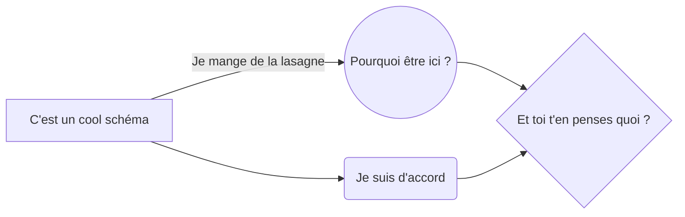

# Je suis pressé

  

Ce document va très

  

## clairement

  

changer, *mais* je pose juste ça là pour que ça fasse un

  

> peu

  

le job quoi,

  

- je

- suis

- temporaire

  

, passez **votre** chemin

  
  

|Je suis le roi|Je vois tout |

|--|--|

| Moi aussi je veux des pouvoirs | Alors moi c'est une glace, c'est pas pareil |

  
  

Mais au moins vous pouvez voir

  

- [x] une page

- [x] une démo de markdown

- [ ] une licorne

  



  

```python

#Le code suivant, étant en python n'est pas terrible :

  

n = int(input("Entrer un nombre : ")) # Mettre du texte dans la même instruction que dans la saisie, mais on aura tout vu.

n *= 10000  # L'incrémentation, c'est une très bonne idée (dommage qu'elle ait été volée au C)

for i in  range (n) : #Un for qui ne ressemble à rien

print("Je veux faire du C") #Absence de ';'

print("Ou alors du C++, ça fait plus de chose")

```

  
  

```C++

#include  <iostream>

#include  <string>

#include  <vector>

  

using  namespace  std;

  

int  main () { // Programme à l'intérieur d'une fonction, c'est bien plus structuré :)

int n = 0; // Un ';' ! C'était trop demandé ?

cout << "Entrer un nombre : ";

cin >> n >> cin.ignore(); // On sépare texte et saisie, c'est bien, ça

for(int i = 0; i < n*1000; i++) { // Un for bien détaillé, on aime bien le C/C++ (plus le C++)

cout << "On se sent bien mieux ici, version " << n << endl;

}

return  0;

}

```

Les bons langages :

  

1. Le C

2. Le C++ (surtout)

  
  
  
  
  
  

Bref, il me reste 
$\lim_{n \to +\infty}(\sum^n_{k=0}2^{-k})^2$ secondes pour vous dire :

  
  
  


[Un click vers un monde meilleur](https://www.youtube.com/watch?v=dQw4w9WgXcQ)
