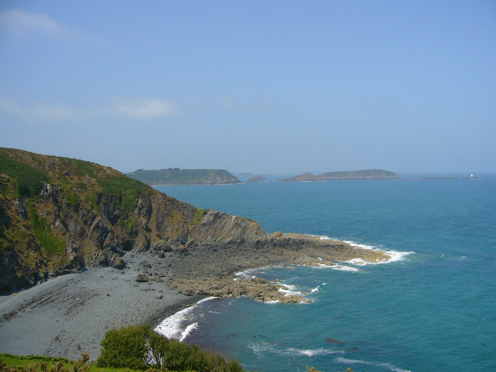

#+title: Longest Coast
#+author: Guillaume BEUVOT - Prep'ISIMA
#+email: guillaume.beuvot@etu.uca.fr
#+options: toc:2
#+options: p:t
#+options: H:4
#+SETUPFILE: https://fniessen.github.io/org-html-themes/org/theme-readtheorg.setup

[[file:images/uca.jpg]]

#+caption: Côtes d'Armor (Source : https://www.flickr.com/photos/24236053@N00/9700081929/)

[[file:longest_coast.txt][Lien vers le document .org]]

* Introduction au puzzle
En imaginant une grille remplie soit de cases d'eau soit de cases d'île, il faut pouvoir déterminer l'île qui a la plus grande côte, soit le nombre total de cases d'eau adjacentes à ses cases d'îles.

Une île est bien-sûr définie par la connexion de plusieures cases d'îles. Une case d'île est connectée à une autre si les deux sont adjacentes (donc les diagonales ne sont pas valides)

Le problème en langage C à traiter est donc, à partir d'une carte, dont les côtés ont la même longueur, de donner l'île avec la plus grande côte ainsi que la taille de la côte, ou le nombre de cases d'eau adjacentes à chaque cases d'île, sans compter pour autant deux fois la même case d'eau si elle est adjacente à deux cases d'île.

** Les données auxquelles nous disposons sont donc :
- Un entier compris enre 3 et 50, qui représente la longueur des côtés de la grille
- La grille, ou carte, où les cases d'eau sont représentées par le caractère =~= et les cases d'île par le caractère =#=

** Les données à renvoyer sont donc :
- Un entier représentant le numéro de l'île qui possède la plus grande côte, suivie de la longueur total de ses côtes (sous forme d'entier)
Pour pouvoir donner le numéro de l'île, il est précisé que l'ordre est le suivant :

+ Nous partons du coin supérieur gauche.

+ Nous parcourons de gauche à droite chaque ligne, puis, en arrivant à la fin d'une ligne, nous passons à la ligne en-dessous

+ Sur le parcours, si une case d'île qui n'a pas été découverte est rencontrée, l'île en question devient la suivante dans l'ordre des îles

* Résolution du puzzle
** Résumé de la méthode
Nous explorons la grille de la manière qui a été précisée.

En rencontrant une île, nous entammons un processus "d'exploration" de l'île, nous découvrons chaque case liée à l'île, puis nous comptons la longueur de la côte de l'île, que nous sauvegarderons, avant de "faire couler" l'île, pour recommencer la recherche, jusqu'à la fin de l'exploration de la grille, c'est-à-dire lorsque la grille est totalement couverte de cases d'eau.

Enfin, nous comparons les côtes de chaque île, puis renvoynons la plus grande.

** Tansposition en langage C
Nous commençons par sauvegarder la carte dans un tableau de chaînes de caractères.

Nous entrons ensuite dans la phase de recherche d'îles, qui sera une boucle imbriquée dans une autre, qui parcourent l'ensemble de la grille:
- Si la case rencontrée est un case d'île :
  + La case actuelle est comptée comme "explorée", et change de caractère.
  + Nous entrons ensuite dans une nouvelle boucle, qui ne s'arrête pas tant que l'île entière n'a pas été explorée, c'est-à-dire qu'aucune case sur l'île ne soit une case d'île non explorée.
    - Cela nous fait entrer dans une autre boucle, qui parcourt l'ensemble de la carte :
    - Si la case rencontrée est une case d'île, nous regardons chaque case adjacente à cette case: s'il y a au moins une case d'île explorée, la case rencontrée est transformée en cases d'île explorée
  + Après l'exploration, nous regardons chaque case d'île explorée, cette fois-ci encore, dans une boucle qui parcourt l'ensemble de la grille :
    - Si la case rencontrée est une case d'île explorée, nous regardons chaque case adjacente à cette case : chaque case d'eau ajoute 1 à la longueur de la côte de l'île et est transformée en case d'eau explorée, pour éviter de la compter une deuxième fois.
  + Enfin, après avoir sauvegardé le numéro de l'île et la longueur de ses côtes, nous entrons dans une boucle qui parcourt chaque case de la grille, puis remplace chaque case d'île explorée et d'eau explorée en case d'eau, pour éviter de les retrouver dans la suite de l'exploration de la grille.
  + Nous passons ensuite à l'île suivante
Lorsque toutes les îles ont été explorées, nous entrons dans une boucle qui compare les longueur des côtes de chaque île :
- Si la longueur des côtes de l'île actuelle est plus grand que la longueur des côtes de l'île avec la plus grande côte, l'île actuelle devient l'île avec la plus grande côte.
Nous renvoyons enfin le numéro de l'île avec la plus grande longueur de côte, suivie de la longueur de sa côte.

** Code en langage C de la résolution

Nous déclarons nos variables :
#+begin_src c
char map1[64][64];
int island = 0;
int coast[256]={0};
int max[2] = {0};
#+end_src
- =char map1[64][64]= sera la grille sur laquelle nous travaillerons, c'est un tableau de chaînes de caractères
- =int island= sera le numero de chaque île, permettant de les placer dans le tableau répertoriant les longueurs de côtes, c'est un entier
- =int coast[256]= sera le tableau répertoriant les longueurs des côtes de chaque île, c'est un tableau d'entiers
- =int max[2]= nous servira à trouver l'île à renvoyer et la longueur de ses côtes, c'est un tableau d'entiers

Nous sauvegardons ensuite la carte dans notre grille, ou tableau de chaînes de caractères:
#+begin_src c
for (int i = 0; i < n; i++) {
    char row[n + 1];
    scanf("%[^\n]", row); fgetc(stdin);
    sprintf(map1[i], "%s", row);
}
#+end_src
Chaque ligne tapée est une chaîne de caractère sauvegardée dans =map1=, permettant de créer une grille.

Nous entrons ensuite dans la boucle de recherche, qui parcourt toute la grille :
#+begin_src c
for(int i = 0; i<n; i++) {
    for(int j = 0; j<n;j++) {
#+end_src

Nous nous arrêtons si nous avou=ns découvert une case d'île:
#+begin_src c
if(map1[i][j]=='#'){
    map1[i][j]='+';
    int explored = 1;
#+end_src
Nous la transformons en case d'île explorée, représentée par le caractère =+=

Nous commençons ensuite l'exploration de l'île, la variable booléenne d'exploration est initialisée à 1, signifiant que l'île n'a été explorée entièrement.

L'exploration se traduit par une boucle, qui s'arrête quand l'exploration est terminée, donc que la variable d'exploration est nulle :
#+begin_src c
while(explored) {
    explored = 0;
#+end_src
La variable d'exploration est mise à 0, nous partons ici du principe que l'île a entièrement été explorée, nou allons donc vérifier chaque case de l'île.

Nous entrons dans une nouvelle boucle, qui parcourt toute la grille.
#+begin_src c
for(int a = 0; a < n; a++) {
    for(int b = 0; b < n; b++) {
#+end_src

Nous nous arrêtons si nous rencontrons une case d'île :
#+begin_src c
if(map1[a][b] == '#') {
    if(map1[a+1][b] == '+' || map1[a][b+1] == '+' || map1[a-1][b] == '+' || map1[a][b-1] == '+'){
        explored = 1;
        map1[a][b] = '+';
    }
}
#+end_src
Si une =+= case d'île explorée se trouve au-dessus, en-dessous, à gauche ou à droite de cette case, nous mettons la variable d'exploration à 1, ce qui veut dire que l'exploration n'est pas terminée, et nous transformons cette case en case d'île explorée.

Après avoir expolré toute l'île, nous pouvons maintenant mesurer la longueur des côtes de l'île avec une boucle qui parcourt toute la grille:
#+begin_src c
for(int a = 0; a < n; a++) {
    for(int b = 0; b < n; b++) {
#+end_src

Nous nous arrêtons si nous rencontrns une case d'île explorée:
#+begin_src c
if(map1[a][b] == '+'){
#+end_src

Nous regardons chaque case adjacente à cette case :
#+begin_src c
if(map1[a-1][b] == '~') {
    map1[a-1][b] = '!';
    coast[island]++;
}
if(map1[a+1][b] == '~') {
    map1[a+1][b] = '!';
    coast[island]++;
}
if(map1[a][b-1] == '~') {
    map1[a][b-1] = '!';
    coast[island]++;
}
if(map1[a][b+1] == '~') {
    map1[a][b+1] = '!';
    coast[island]++;
} 
#+end_src
Si une case d'eau est trouvée, nous transformons la case d'eau en case d'eau explorée puis nous augmentons la taille de la côte de l'île.

Enfin, après avoir parcouru toutes la côte de l'île, nous réalisons un dernier parcours de toute la grille, pour remplacer les cases explorées par des cases d'eau :
#+begin_src c
for(int a = 0; a < n; a++) {
    for(int b = 0; b < n; b++) {
        if(map1[a][b]=='!' || map1[a][b]=='+')map1[a][b]='~';
    }
}
#+end_src

Nous passons ainsi à l'île suivante, que nous allons devoir chercher :
#+begin_src c
island++;
#+end_src

Finalement, à la fin de la boucle principale, nous comparons les côtes des îles :
#+begin_src c
for(int i = 0; i <island; i++) {
    if(max[1] < coast[i]) {
        max[0] = i;
        max[1] = coast[i];
    }
}
#+end_src
Nous remplaçons l'île ayant une longueur de côte maximale par une île qui a une plus grande côte.
La première case du tableau =max= correspond au numéro de l'île, la deuxième case correspond à la longueur des côtes de l'île.

Nous finissons par renvoyer le numéro de l'île avec la plus grande côte, suivi par la longueur de ses côtes.
#+begin_src c
printf("%d %d\n", max[0]+1, max[1]);
#+end_src

* Solution d'un autre CodinGamer

L'utilisateur [[https://www.codingame.com/profile/1a90baa85a42949605163c749d82a0110245803][MJZ]] utilise une méthode avec un algorithme demandant moins de place en mémoire, en offrant une solution incluant une fonction =count_water= récursive :

#+begin_src c
int count_water(int r, int c){
    if(r < 0 || r >= n)  return 0;
    if(c < 0 || c >= n)  return 0;
    if(map[r][c] == '~'){
        map[r][c] = 'W';
        return 1;
    }
    if(map[r][c] == '#'){
        map[r][c] = 'X';
        return count_water(r+1, c) + count_water(r, c+1) +
               count_water(r-1, c) + count_water(r, c-1);
    }
    return 0;
}
#+end_src
- Dans le cas où la case ne se trouve pas sur la grille, la fonction renvoie 0,
- Dans le cas où la case est une case d'eau, la case est transformée en case d'eau explorée =W= et renvoie 1,
- Dans le cas où la case est une case d'île, la case est transformée en case d'île explorée =X= et renvoie la somme de ce que renvoie =count_water= pour les case adjacentes.

Il utilise ensuite une fonction =restore_water= pour rétablir les cases d'eau :
#+begin_src c
void restore_water(){
    for(int r = 0; r < n; r++)
        for(int c = 0; c < n; c++)
            if(map[r][c] == 'W')
                map[r][c] = '~';
}
#+end_src
Cette fonction parcourt toute la grille et remplace les cases d'eau explorée en cases d'eau.

La fonction principale :
#+begin_src c
int main(){
    scanf("%d", &n);
    for(int r = 0; r < n; r++)
        scanf("%s", map[r]);
    for(int r = 0; r < n; r++)
        for(int c = 0; c < n; c++)
            if(map[r][c] == '#'){
                water[islands++] = count_water(r, c);
                restore_water();
            }
    int imax = 0;
    for(int i = 1; i < islands; i++)
        if(water[imax] < water[i])
            imax = i;
    printf("%i %i", imax + 1, water[imax]);
}
#+end_src

Il parcourt la grille avec une boucle :
- Pour chaque île non explorée (à la rencontre d'une case d'île non explorée) :
  + Il compte les côtes de l'île avec la fonction =count_water=
  + Il appelle ensuite la fonction =restore_water=
Enfin, il compare les tailles de côte et renvoie l'île avec la côte la plus grande et la taille de sa côte.

Cette solution est intéressante car elle utilise moins de mémoire car elle effectue moins de parcours de grille, en utilisant notamment une fonction récursive.

Le code est ainsi compact, avec 43 lignes.

* Bilan
La résolution de ce puzzle est un travail de réflexion algorithmique qui permet de se mettre à l'épreuve en tant que programmeur afin de pouvoir trouver une solution à un problème qui, malgré un énoncé simple, demande un travail  de réflexion plus poussé.
